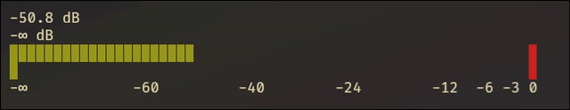

# rataudio-meter

An adapted version of the [ratatui](https://ratatui.rs/) `Gauge` `Widget` for displaying audio meter data in the terminal partly inspired by [Meter](https://github.com/cgbur/meter?tab=readme-ov-file).


```
cargo run --example demo
```


